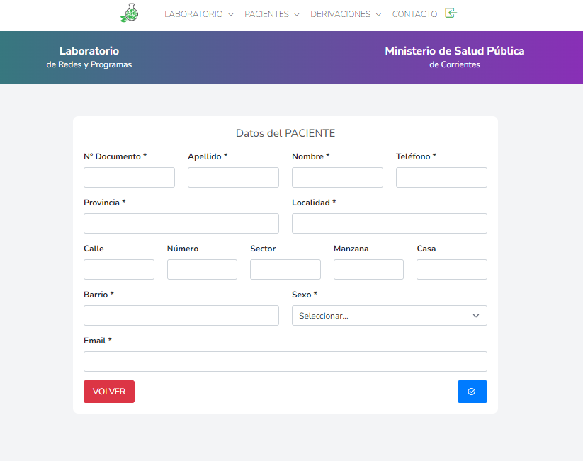
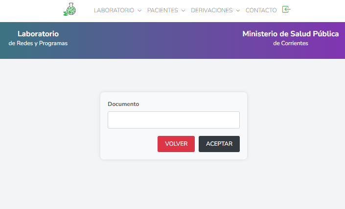
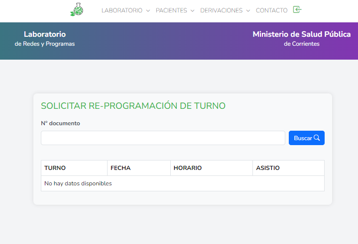

# Gestion de laboratorio REACT (Frontend) - LARAVEL, MySql (backend)

<h2> Sitema completo de gestion para un Laboratorio Clínico: </h2>

<h3>ADMINISTRACIÓN:</h3>
<ul> 
    <li>Administración de turnos</li>
    <li>Subir resultados</li>
    <li>Roles de usuarios</li>
</ul>

<h3>USUARIO:</h3>
<ul> 
    <li>Login y Registro</li>
    <li>Solicitar turno</li>
    <li>Reprogramar turno</li>
    <li>Visualizar/Descargar resultados</li>
</ul>

